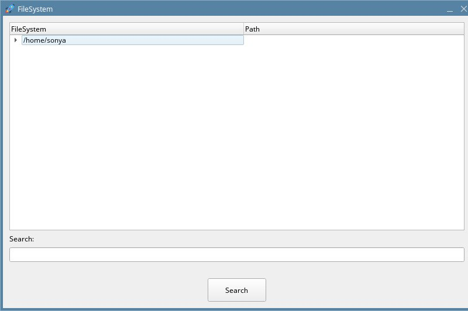
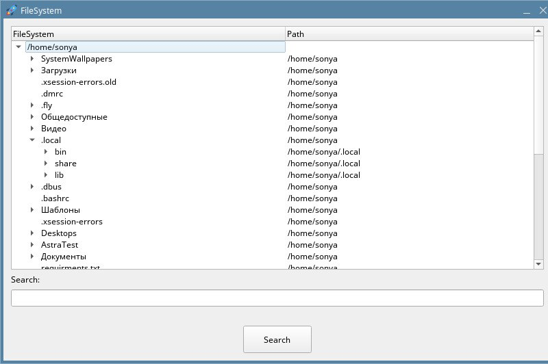
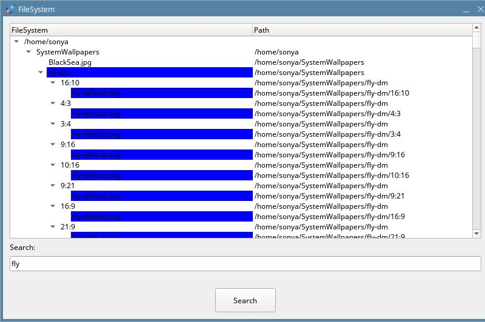
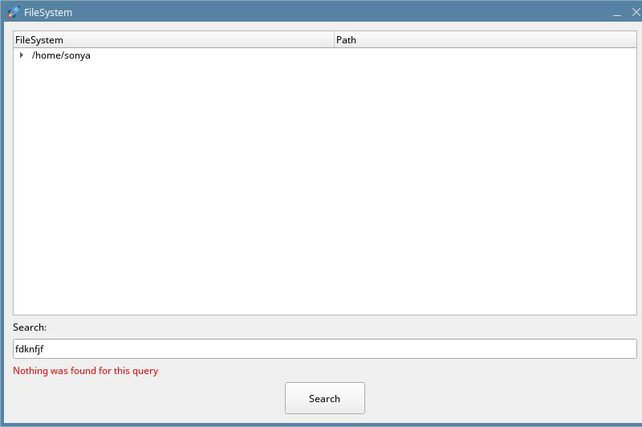
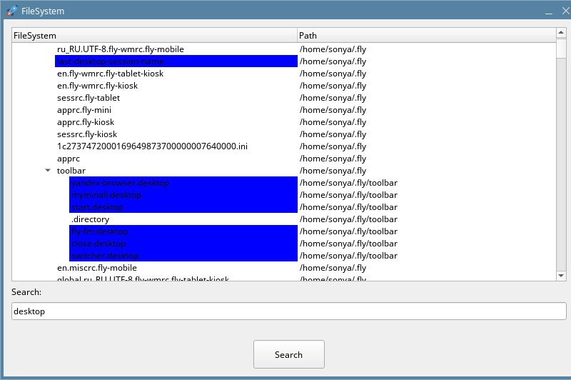

# FileSystem
Приложение для просмотра файловой системы.

## Описание
В приложении можно увидеть дерево файловой системы и осуществлять поиск по именам файлов и директорий.

## Стэк технологий
Python, PyQt

## Установка
- Прилжение можно установить через библиотеку PyInstaller.
- Из папки проекта: `python -m pyinstaller -F filesystem.py`
- После этого в директории dist появится исполняемый файл.
